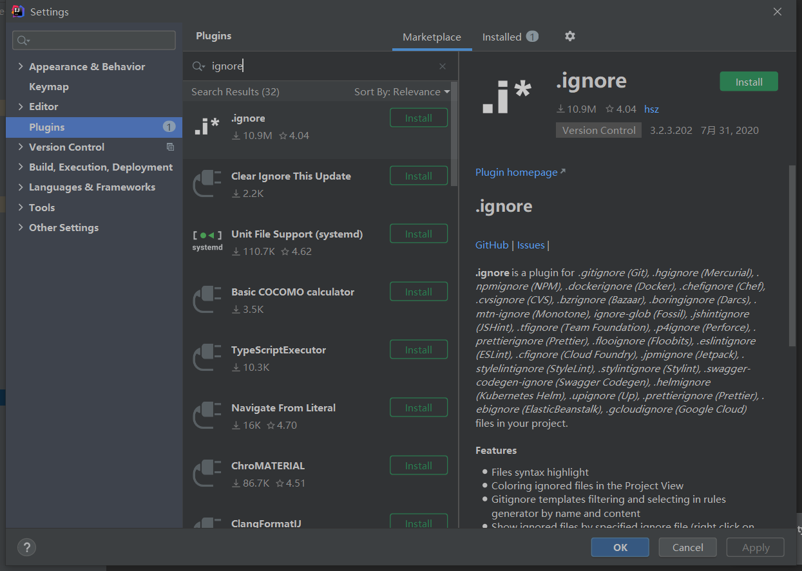
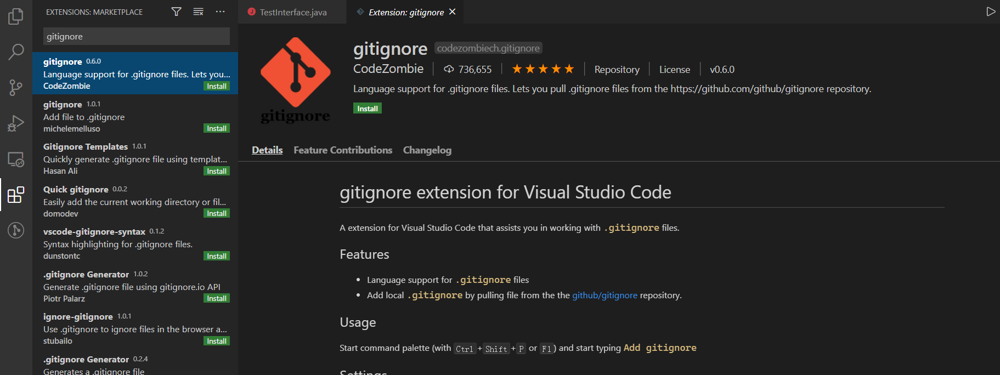

[toc]

# GIT 文件排除文件说明

## 插件

### IDEA



### VSCODE




## 使用说明

在使用Git的过程中，有的文件比如日志，临时文件，编译的中间文件等不要提交到代码仓库，这时就要设置相应的忽略规则，来忽略这些文件的提交。简单来说一个场景：在你使用git add .的时候，遇到了把你不想提交的文件也添加到了缓存中去的情况，比如项目的本地配置信息，如果你上传到Git中去其他人pull下来的时候就会和他本地的配置有冲突，所以这样的个性化配置文件我们一般不把它推送到git服务器中，但是又为了偷懒每次添加缓存的时候都想用git add .而不是手动一个一个文件添加，该怎么办呢？很简单，git为我们提供了一个.gitignore文件，只要在这个文件中声明哪些文件你不希望添加到git中去，这样当你使用git add .的时候这些文件就会被自动忽略掉。

### **Git忽略文件的原则**

- 忽略操作系统自动生成的文件，比如缩略图等；
- 忽略编译生成的中间文件、可执行文件等，也就是如果一个文件是通过另一个文件自动生成的，那自动生成的文件就没必要放进版本库，比如产生的.log日志文件；
- 忽略你自己的带有敏感信息的配置文件，比如存放口令的配置文件。

### **.gitignore文件的使用方法** 

首先，在你的工作区新建一个名称为.gitignore的文件。 然后，把要忽略的文件名填进去，Git就会自动忽略这些文件。不需要从头写.gitignore文件，GitHub已经为我们准备了各种配置文件，只需要组合一下就可以使用了。[https://github.com/github/gitignore](https://link.zhihu.com/?target=https%3A//github.com/github/gitignore)。

```bash
# dir 不需要提交的目录
/node_modules

# file 不需要提交的文件
config.ini

# log 不需要提交的任意包含后缀名为log的文件
*.log

# Package Files 不需要提交的任意包含后缀名为jar的文件
*.jar
```

.gitignore注释用'#', *表示匹配0个或多个任意字符，所以上面的模式就是要忽略所有的xml文件,log文件和apk文件。

.gitignore配置文件用于配置不需要加入版本管理的文件，配置好该文件可以为版本管理带来很大的便利。

如果有些文件已经被忽略了，当使用`git add`时是无法添加的。需要加上`-f`参数才能强制添加到git中去，这样就能强制添加到缓存中去了。

```bash
git add -f node_modules/jquery/dist/jquery.min.js
```

如果我们意外的将想要忽略的文件添加到缓存中去了，我们可以使用`rm`命令将其从中移除：

```bash
git rm --cached test.js 
```

**.gitignore忽略规则的优先级**

```properties
在 .gitingore 文件中，每一行指定一个忽略规则，Git检查忽略规则的时候有多个来源，它的优先级如下（由高到低）：
1、从命令行中读取可用的忽略规则
2、当前目录定义的规则
3、父级目录定义的规则，依次递推
4、$GIT_DIR/info/exclude 文件中定义的规则
5、core.excludesfile中定义的全局规则
```

**.gitignore忽略规则的匹配语法**

```properties
在 .gitignore 文件中，每一行的忽略规则的语法如下：
1、空格不匹配任意文件，可作为分隔符，可用反斜杠转义
2、以“＃”开头的行都会被 Git 忽略。即#开头的文件标识注释，可以使用反斜杠进行转义。
3、可以使用标准的glob模式匹配。所谓的glob模式是指shell所使用的简化了的正则表达式。
4、以斜杠"/"开头表示目录；"/"结束的模式只匹配文件夹以及在该文件夹路径下的内容，但是不匹配该文件；"/"开始的模式匹配项目跟目录；如果一个模式不包含斜杠，则它匹配相对于当前 .gitignore 文件路径的内容，如果该模式不在 .gitignore 文件中，则相对于项目根目录。
5、以星号"*"通配多个字符，即匹配多个任意字符；使用两个星号"**" 表示匹配任意中间目录，比如a/**/z可以匹配 a/z, a/b/z 或 a/b/c/z等。
6、以问号"?"通配单个字符，即匹配一个任意字符；
7、以方括号"[]"包含单个字符的匹配列表，即匹配任何一个列在方括号中的字符。比如[abc]表示要么匹配一个a，要么匹配一个b，要么匹配一个c；如果在方括号中使用短划线分隔两个字符，表示所有在这两个字符范围内的都可以匹配。比如[0-9]表示匹配所有0到9的数字，[a-z]表示匹配任意的小写字母）。
8、以叹号"!"表示不忽略(跟踪)匹配到的文件或目录，即要忽略指定模式以外的文件或目录，可以在模式前加上惊叹号（!）取反。需要特别注意的是：如果文件的父目录已经被前面的规则排除掉了，那么对这个文件用"!"规则是不起作用的。也就是说"!"开头的模式表示否定，该文件将会再次被包含，如果排除了该文件的父级目录，则使用"!"也不会再次被包含。可以使用反斜杠进行转义。
```

**需要谨记**：git对于.ignore配置文件是按行从上到下进行规则匹配的，意味着如果前面的规则匹配的范围更大，则后面的规则将不会生效；

**十分重要**：如果你不慎在创建.gitignore文件之前就push了项目，那么即使你在.gitignore文件中写入新的过滤规则，这些规则也不会起作用，Git仍然会对所有文件进行版本管理。简单来说出现这种问题的原因就是Git已经开始管理这些文件了，所以你无法再通过过滤规则过滤它们。所以大家一定要养成在项目开始就创建.gitignore文件的习惯，否则一单push，处理起来会非常麻烦。

```properties
#               表示此为注释,将被Git忽略
*.a             表示忽略所有 .a 结尾的文件
!lib.a          表示但lib.a除外
/TODO           表示仅仅忽略项目根目录下的 TODO 文件，不包括 subdir/TODO
build/          表示忽略 build/目录下的所有文件，过滤整个build文件夹；
doc/*.txt       表示会忽略doc/notes.txt但不包括 doc/server/arch.txt
 
bin/:           表示忽略当前路径下的bin文件夹，该文件夹下的所有内容都会被忽略，不忽略 bin 文件
/bin:           表示忽略根目录下的bin文件
/*.c:           表示忽略cat.c，不忽略 build/cat.c
debug/*.obj:    表示忽略debug/io.obj，不忽略 debug/common/io.obj和tools/debug/io.obj
**/foo:         表示忽略/foo,a/foo,a/b/foo等
a/**/b:         表示忽略a/b, a/x/b,a/x/y/b等
!/bin/run.sh    表示不忽略bin目录下的run.sh文件
*.log:          表示忽略所有 .log 文件
config.php:     表示忽略当前路径的 config.php 文件
 
/mtk/           表示过滤整个文件夹
*.zip           表示过滤所有.zip文件
/mtk/do.c       表示过滤某个具体文件
 
被过滤掉的文件就不会出现在git仓库中（gitlab或github）了，当然本地库中还有，只是push的时候不会上传。
 
需要注意的是，gitignore还可以指定要将哪些文件添加到版本管理中，如下：
!*.zip
!/mtk/one.txt
 
唯一的区别就是规则开头多了一个感叹号，Git会将满足这类规则的文件添加到版本管理中。为什么要有两种规则呢？
想象一个场景：假如我们只需要管理/mtk/目录中的one.txt文件，这个目录中的其他文件都不需要管理，那么.gitignore规则应写为：：
/mtk/*
!/mtk/one.txt
 
假设我们只有过滤规则，而没有添加规则，那么我们就需要把/mtk/目录下除了one.txt以外的所有文件都写出来！
注意上面的/mtk/*不能写为/mtk/，否则父目录被前面的规则排除掉了，one.txt文件虽然加了!过滤规则，也不会生效！
 
----------------------------------------------------------------------------------
还有一些规则如下：
fd1/*
说明：忽略目录 fd1 下的全部内容；注意，不管是根目录下的 /fd1/ 目录，还是某个子目录 /child/fd1/ 目录，都会被忽略；
 
/fd1/*
说明：忽略根目录下的 /fd1/ 目录的全部内容；
 
/*
!.gitignore
!/fw/ 
/fw/*
!/fw/bin/
!/fw/sf/
说明：忽略全部内容，但是不忽略 .gitignore 文件、根目录下的 /fw/bin/ 和 /fw/sf/ 目录；注意要先对bin/的父目录使用!规则，使其不被排除。
```

如果你已经把不想上传的文件上传到了git仓库，那么你必须先从远程仓库删了它，我们可以从远程仓库直接删除然后pull代码到本地仓库这些文件就会本删除，或者从本地删除这些文件并且在.gitignore文件中添加这些你想忽略的文件，然后再push到远程仓库。

**gitignor忽略规则查看** 如果你发下.gitignore写得有问题，需要找出来到底哪个规则写错了，可以用git check-ignore命令检查：

```SHELL
git check-ignore -v xxx.js
```

