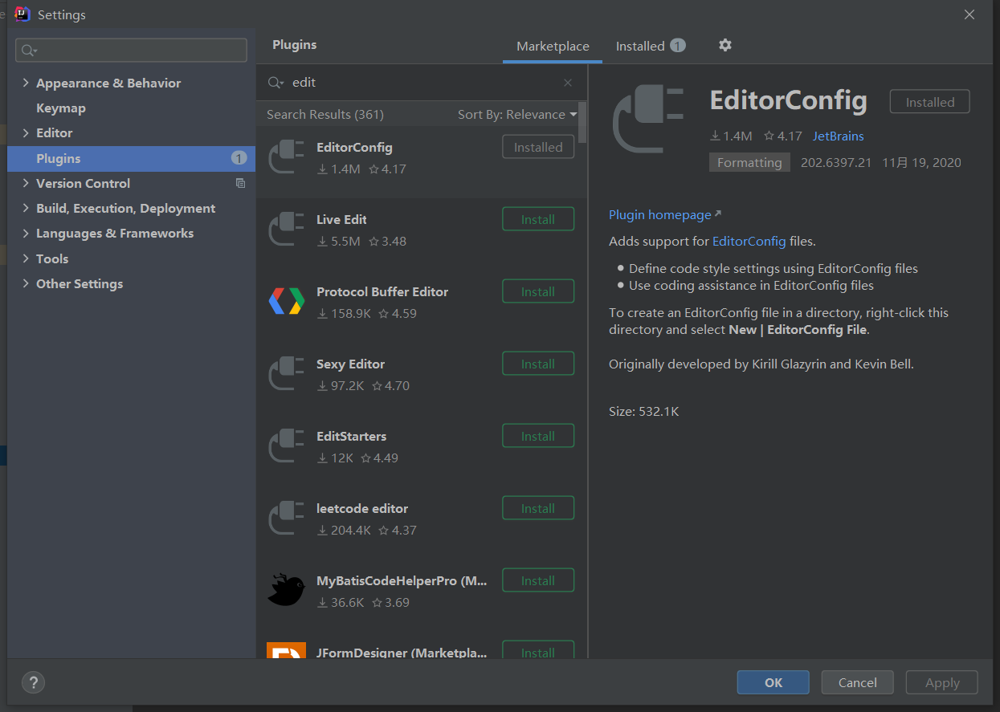
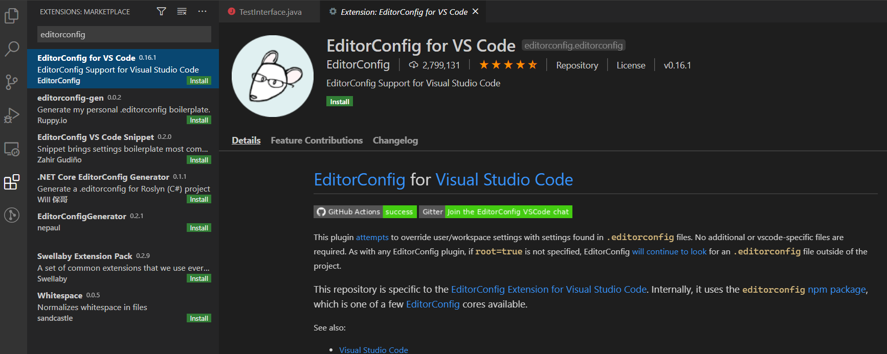

# EDIT CONFIG 使用指南

editconfig 可以方便的统一各个ide ,环境下的文件编码规则，包括文件编码，换行样式等

## 插件安装

### IDEA

按下图安装对应的EditorConfig 插件，一些版本的IDEA已经安装好



### VSCODE



### 常用配置说明

#### 配置文件

> `.editorconfig` 为editorconfig 的配置文件，放在项目的根路径  

#### 配置说明

样例：

```properties
# A special property that should be specified at the top of the file outside of
# any sections. Set to true to stop .editor config file search on current file
root = true

[*]
# Indentation style
# Possible values - tab, space
indent_style = space

# Indentation size in single-spaced characters
# Possible values - an integer, tab
indent_size = 2

# Line ending file format
# Possible values - lf, crlf, cr
end_of_line = lf

# File character encoding
# Possible values - latin1, utf-8, utf-16be, utf-16le
charset = utf-8

# Denotes whether to trim whitespace at the end of lines
# Possible values - true, false
trim_trailing_whitespace = true

# Denotes whether file should end with a newline
# Possible values - true, false
insert_final_newline = true
```

 editorconfig常用配置

```properties
*                匹配除/之外的任意字符串
**               匹配任意字符串
?                匹配任意单个字符
[name]           匹配name中的任意一个单一字符
[!name]          匹配不存在name中的任意一个单一字符
{s1,s2,s3}       匹配给定的字符串中的任意一个(用逗号分隔) 
{num1..num2}   　匹配num1到num2之间的任意一个整数, 这里的num1和num2可以为正整数也可以为负整数
```

各种属性

```properties
indent_style              设置缩进风格(tab是硬缩进，space为软缩进)
indent_size               用一个整数定义的列数来设置缩进的宽度，如果indent_style为tab，则此属性默认为  tab_width
tab_width                 用一个整数来设置tab缩进的列数。默认是indent_size
end_of_line               设置换行符，值为lf、cr和crlf
charset                   设置编码，值为latin1、utf-8、utf-8-bom、utf-16be和utf-16le，不建议使用utf-8-bom
trim_trailing_whitespace  设为true表示会去除换行行首的任意空白字符。
insert_final_newline      设为true表示使文件以一个空白行结尾
root        　　　         表示是最顶层的配置文件，发现设为true时，才会停止查找.editorconfig文件  
```

#### 官方文档

[https://editorconfig.org/](https://editorconfig.org/)

